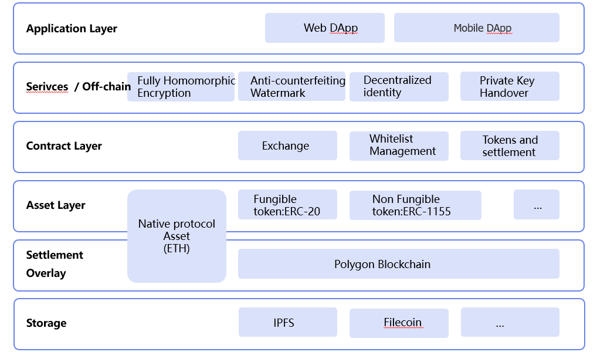

------

<h3 align="center">New ways to buy and read books in the Web3 era</h3>

## Introduction

dbookmarket is a NFT book marketplace. We make it easy for authors to publish and sell their works as NFT books while protecting the copyright content through our encryption. Only NFT holders can access and read the digital book using the dbookmarket app. Book lovers who buy NFT books have the option of selling the books and authors will receive their designated royalties on secondary sales.

## **Vision** 

We want to create a marketplace for NFT books in the Web3 era that protects authors' copyright while increasing their income, encourages readers to read and learn through gameFi and socialFi, and is a DAO community.

## Target User

- Authors who want to earn/promote their work through Web3

- Readers who need motivation to keep reading on their own

- Collectors who like to collect NFT/ limited digital books

## Core Architecture

<h1 align="center">
  
</h1>

## Presentations

-  [pitch deck](file/pitch_deck.pptx) 

-  [pitch deck（中文）](file/pitch_deck_chinese.pptx) 

- [Demo](https://dbookmarket.com/#/)

- [Demo Video](https://www.youtube.com/watch?v=IL5l2r7GaYk)

## Repositories

- [Web Application](https://github.com/dBookMarket/DBook.Web)

- [Mobile Application](https://github.com/dBookMarket/DBook.Flutter)
- [Smart Contracts](https://github.com/dBookMarket/DBook.Solidity)
- [Server](https://github.com/dBookMarket/DBook.Django)

## Contributors

[R-Future](https://github.com/R-Future)

[xuxinlai2002](https://github.com/xuxinlai2002)

[linxi1020](https://github.com/linxi1020)

[horry](https://github.com/onlyYU)

## License

This project is licensed under the MIT license, Copyright (c) 2022 dBookMarket. For more information see `LICENSE.md`.

